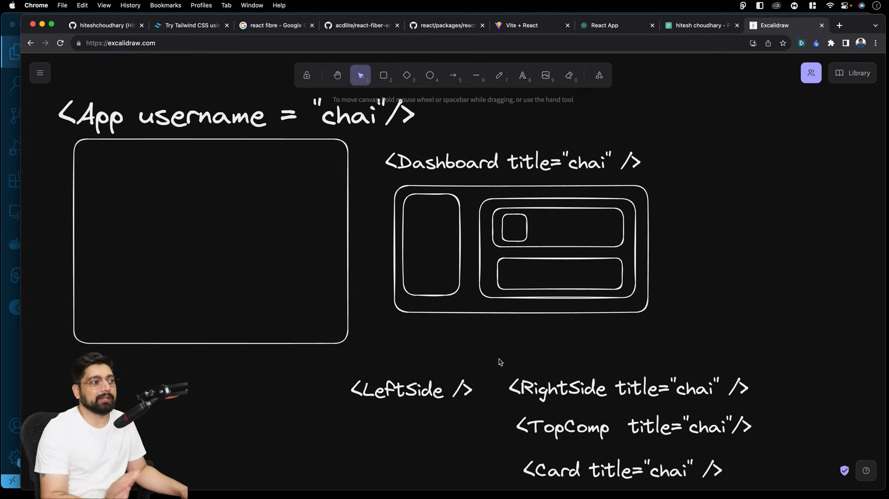

# Context API crash course with 2 projects

- Concept of Prop Drilling 
  - Scenario 1 
 
There is App component and a card component inside inside App component ; so when required to pass a prop  to card its easy to do it in App component 
  - Scenario 2
 
Here say we want to build a admin dashboard ; having nested components as shown ; so what we have to do is to pass props to nested components
  the prop title to reach card we have to pass it through all the parent components of card as shown ; but there is not really need of it

- make a global file variable or context 
- 
{
    title : "chai"
}
  - so that Card component can directly reference to it ; instead of passing it through props through all the nested parent components
- Problem again ; as it is global variable it can be modified by any component so solution is  following

- State Management Tools/library
  - Context API
  - Redux
    - Redux toolkit(RTK)
  - zustand


- Make a new vite project 08miniContext 
  - Clean App.jsx and test it
   - Make a new folder context in the src folder
   - make a new file context.js and write
```js
import React from "react";
const UserContext = React.createContext()
export default UserContext
```
- it will something like a wrapper ; all the components will have access to the data of usercontext
```js
<UserContext>
<Login />
    <Card>
        <Data/>
    </Card>
</UserContext>
```

- Make a new file UserContextProvider.jsx and write
  - this file act as a store ; wrap all the components in this file and pass the data in the value prop of UserContext.Provider
  - children here is div or any component that is going to be wrapped
```js
import React, { useState } from "react";
import UserContext from "./UserContext";
const UserContextProvider = ({children}) => {
    const [user , setUser] = useState(null)
    return (
       <UserContext.Provider value={{user , setUser}}>
        {children}
       </UserContext.Provider>
    )
}
```

- to use it ; modify App.jsx ;  everything within this wrapper ; will have access to the data prop value of UserContext
```js
  return (
    <UserContextProvider>
      <h1>React with chai</h1>
    </UserContextProvider>
  )
```

- Now make components 
- Login.jsx 
   - here we fetch the setUser function from the context provider and passed  an object of username and password to usercontext
```js
import React, {useState, useContext} from 'react'
import UserContext from '../context/UserContext'

function Login() {
    const [username, setUsername] = useState('')
    const [password, setPassword] = useState('')

    const {setUser} = useContext(UserContext)

    const handleSubmit = (e) => {
        e.preventDefault()
        setUser({username, password})
    }
  return (
    <div>
        <h2>Login</h2>
        <input type='text'
        value={username}
        onChange={(e) => setUsername(e.target.value) }
        placeholder='username'  />
        {" "}
        <input type='text' 
        value={password}
        onChange={(e) => setPassword(e.target.value) }
        placeholder='password'  />
        <button onClick={handleSubmit}>Submit</button>
    </div>
  )
}

export default Login
```

- Profile.jsx
   - here we are checking if the user exists or not and fetching the username from usercontext
```js
import React , { useContext } from 'react'
import { UserContext } from '../context/UserContext'

const Profile = () => {
    const {user} = useContext(UserContext)

    if(!user) return <div>Please Login</div>

    return <div>Welcome {user.username}</div>
}

export default Profile
```


- Part 2 :
- Toggling between dark and light mode 
  - Go to tailwind playground [link](https://play.tailwindcss.com/)
  - and inspect and try changing the dark to light in html tag
<html lang="en" class="fixed overflow-hidden h-full dark"><head>
- This is the concept we are going to use
